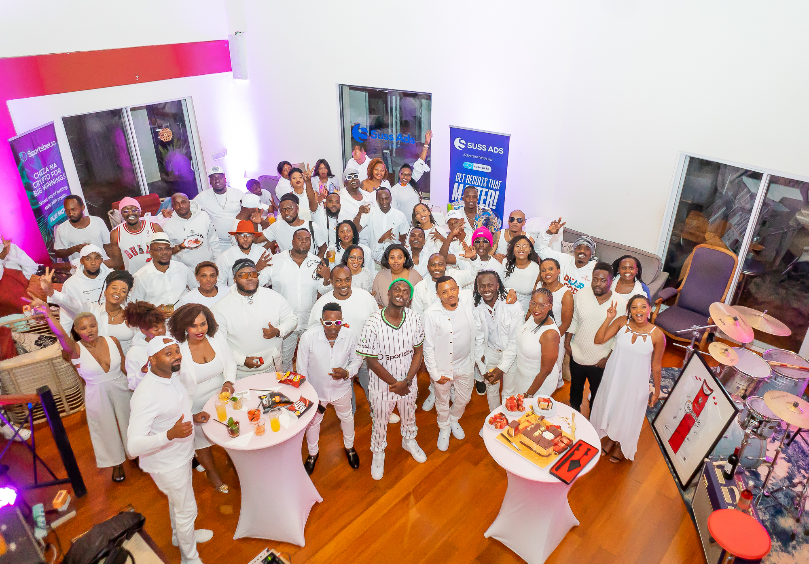
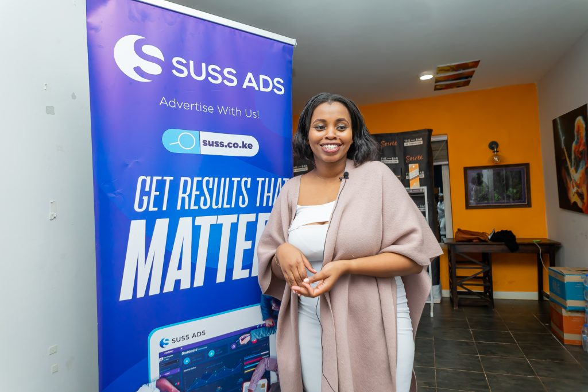
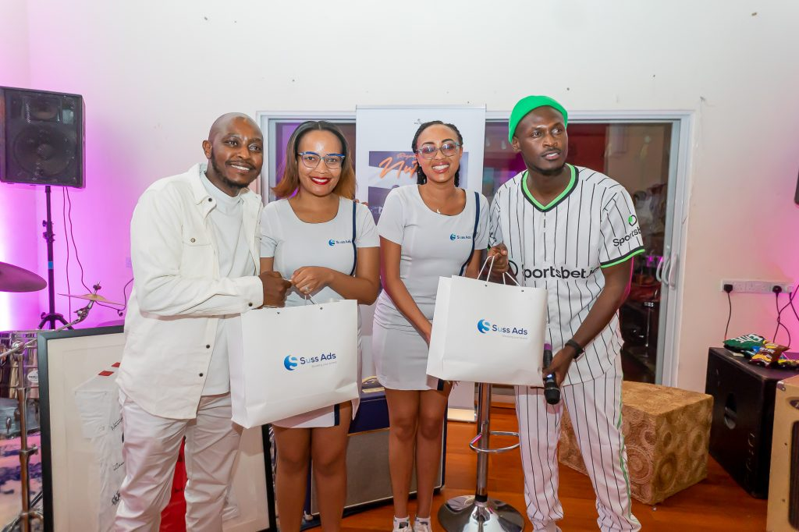

import coverImage from './kingkaka.jpg';
import authorImage from './dennis-soma.webp';

export const article = {
  date: '2023-10-19',
  title:
    'Celebrating Creativity and Consistency through King Kaka’s ‘Rhyme Book Ya Nutcase',
  coverImage: { src: coverImage },
  description:
    'Celebrating Creativity and Consistency through King Kaka’s ‘Rhyme Book Ya Nutcase',
  author: {
    name: 'Dennis Maina',
    role: 'Managing Partner',
    image: { src: authorImage },
  },
};

export const metadata = {
  title: article.title,
  description: article.description,
  openGraph: {
    images: './kingkaka.jpg',
  },
};

On October 19th, 2023, the enchanting Snowball Studios hosted King Kaka’s exclusive listening party for his eagerly anticipated EP “Rhyme Book Ya Nutcase”. The EP is set to release on October 22nd, 2023. What made this listening party special was its immersive quality. King Kaka didn’t just offer a glimpse into his new EP, he opened the door to his creative process, sharing insights, inspirations, and stories behind his songs. Attendees had the privilege of not only witnessing but also participating in the creative journey, forging a connection that went beyond the typical artist-fan relationship.

“Rhyme Book Ya Nutcase” features a remarkable lineup of artists like Prezzo, Masauti, Pascal Tokodi, Halisi the Band, Ruguru, and Jadi, and is set to enthrall music enthusiasts. The listening party was made possible with the support of notable companies like Sportsbet.io, Mister Wok, Ola Tortilla chips, Bakeries, and Suss Ads. Suss Ads, in particular, stood out as the main sponsor, and their dedication to supporting the creative economy deserves recognition.

This partnership celebrates the heart of the creative industry, where artistic expression intersects with commercialism. This is the second event in which Suss Ads and the artist have collaborated, the first being “The Coliseum” at the Kenya National Museum in August of the same year. During the event, Suss Ads emphasized the pivotal role that creativity, content, and strategic distribution play in modern marketing. They showcased their prowess in creative marketing by highlighting the array of engaging ad formats they offer, including video ads, display ads, push notifications, pop ads, interstitial ads, and native ads, among others. This versatility equips creatives and businesses with the effective tools needed to engage their audiences in a dynamic and ever-evolving landscape.

As we look forward to the release of King Kaka’s EP and the countless artistic adventures to come, let’s continue to champion the heart of the creative industry, where music, artistry, and passion unite to enrich our lives and culture. The listening party wasn’t just a night of music; it was a showcase of King Kaka’s creative genius and storytelling finesse. Stay tuned for the release of “Rhyme Book Ya Nutcase” this Sunday, October 22nd!
