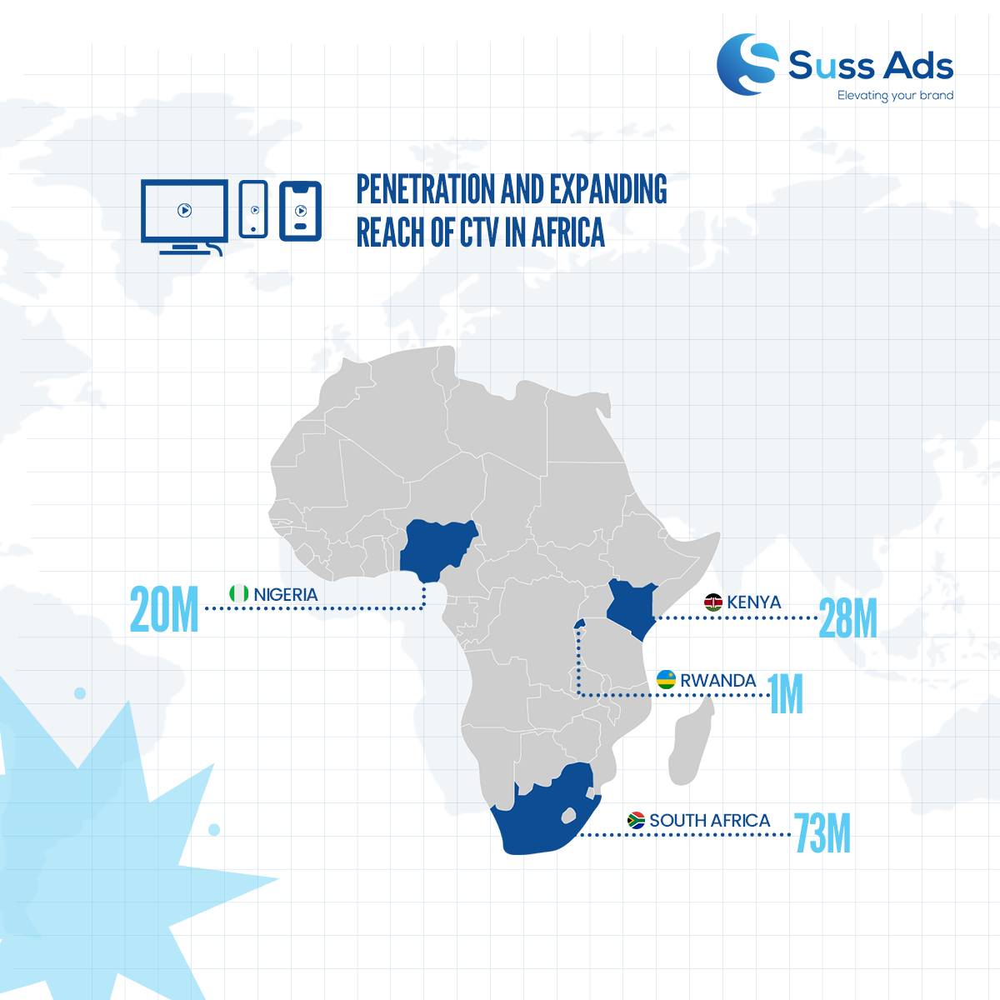
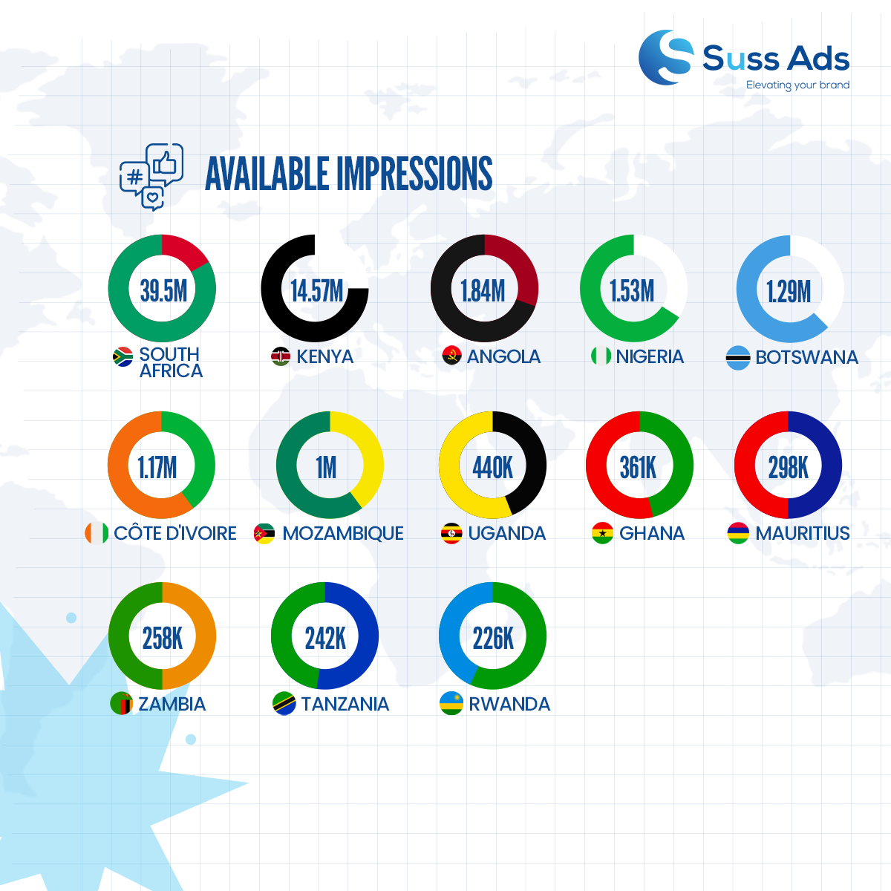
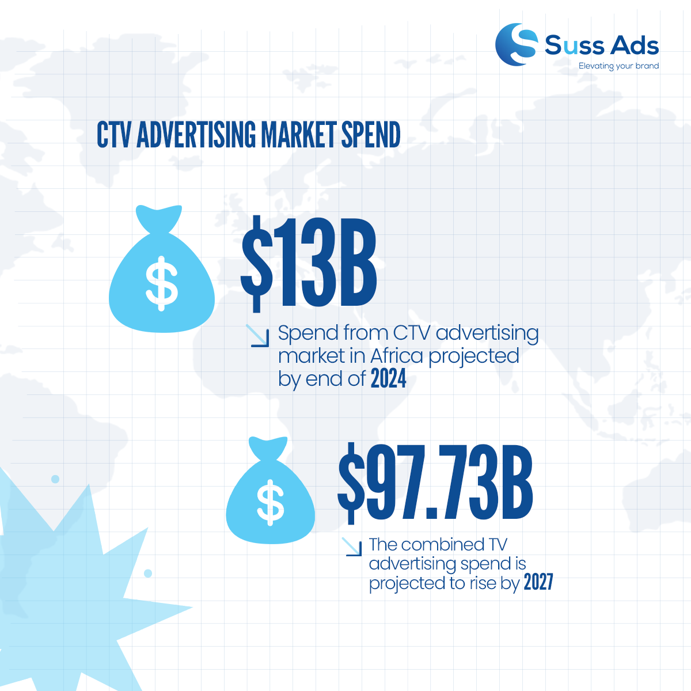
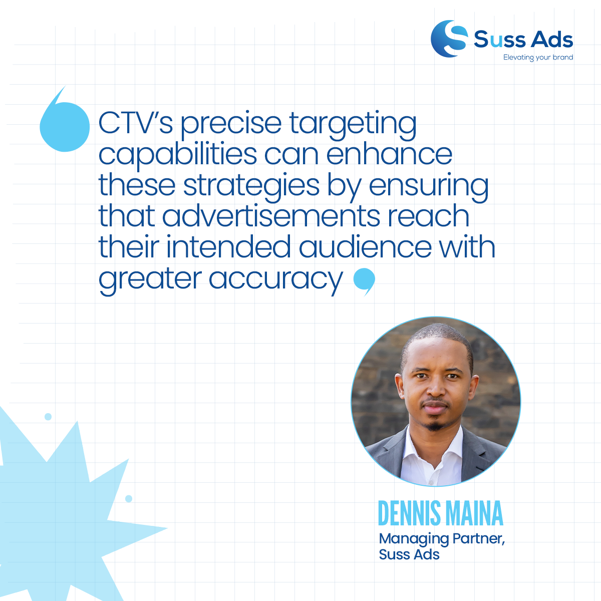

import authorImage from './dennis-soma.webp';
import coverImage from './coverImage.png';

export const article = {
  date: '2024-08-28',
  title: 'Embracing the Rise of CTV and the Enduring Power of Linear TV',
  coverImage: { src: coverImage },
  description:
    'Africas TV ad landscape is undergoing a seismic shift. CTV is rising, offering targeted ads, while Linear TV remains a powerhouse for broad reach. Advertisers must strategically allocate budgets between the two to maximize impact in this dynamic market. Suss Ads, with deep regional insight, is guiding clients through this transformation, combining the best of both worlds for effective campaigns.',
  author: {
    name: 'Dennis Maina',
    role: 'Managing Partner',
    image: { src: authorImage },
  },
};

export const metadata = {
  title: article.title,
  description: article.description,
  openGraph: {
    images: '../../../public/images/blogs/coverImage.png',
  },
};

**Africa’s advertising landscape is changing.** Marketers now balance the rise of **Connected TV (CTV)** with the lasting value of **Linear TV**. CTV is expanding across the continent, bringing both opportunities and challenges, such as ad overload and rising competition.

In **Kenya** and other African markets, CTV is becoming a key player. It offers flexibility and personalized content. As this shift from Linear TV happens, key questions arise: **How should advertisers spend their budgets? Is it time to focus on CTV?**

**Data shows a big opportunity in CTV.** Apps like _FlixPreview_ and _FlavorFiesta_ on the [Suss Ads](http://suss.co.ke) Platform recorded **2.1 million** and **1.4 million** impressions. _TCL_ also made an impact with **1.2 million** impressions, and _LongTV MLauncher_ had **200,000**.

As more African households adopt connected devices, CTV’s importance grows. Yet, **Linear TV remains powerful** in Africa’s ad mix.

“**Linear TV still reaches broad audiences and drives immediate action,**” says [Dennis Maina](https://www.linkedin.com/in/dennis-macharia-1848379b/), Managing Partner at Suss Ads. “While CTV is precise and measurable, Linear TV is key for broad brand awareness.”

Even with CTV’s rise, Linear TV remains strong in Kenya, as shown by the [Communication Authority's](https://www.ca.go.ke/) 2023–2024 Audience Measurement Report. **TV viewing is high in Central Kenya and among men.** Younger, urban audiences are shifting toward CTV.

Maina highlights **timing and targeting** as crucial. “Understanding peak viewing hours and using CTV’s precise targeting ensures ads reach the right audience,” he says.

**Looking ahead,** Africa’s CTV ad market should surpass early 2020 figures by approximately **$13 billion** by 2024. Linear TV remains relevant, especially for older viewers, but its ad spend is shrinking. Still, combined TV ad spending should reach **$97.73 billion** by 2027, according to [eMarketer](https://www.emarketer.com/content/ctv-filling-gaps-declining-linear-tv-ad-spend).

With deep regional insight, **Suss Ads** is ready to guide clients through this changing landscape. Suss Ads combines insights from CTV and Linear TV to optimize strategies and engage audiences across Africa.

“**Adapting to tech and changing consumer habits is crucial,**” says Maina. “We combine CTV and Linear TV to achieve strong results in Africa’s dynamic market.”

