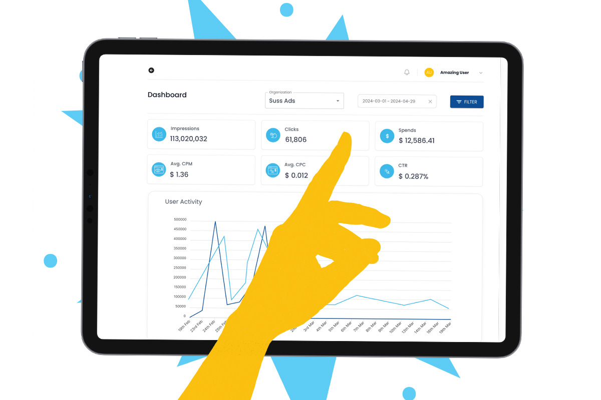

import authorImage from './dennis-soma.webp';
import coverImage from './Ad_Tech_Website.jpg';

export const article = {
  date: '2024-05-28',
  title: 'How Suss Ads optimizes Ad inventory for viewability and engagement',
  coverImage: { src: coverImage },
  description:
    'Discover how Suss Ads maximizes ad inventory for viewability and engagement by leveraging industry standards, responsive design, strategic ad placements, optimized load speeds, advanced ad technology, and continuous performance monitoring. Learn how our innovative approaches ensure impactful ad placements, boost user engagement, and drive superior campaign performance, empowering businesses to achieve greater ROI and long-term growth. Explore how our cutting-edge solutions can transform your advertising strategy for success in a competitive digital landscape.',
  author: {
    name: 'Dennis Maina',
    role: 'Managing Partner',
    image: { src: authorImage },
  },
};

export const metadata = {
  title: article.title,
  description: article.description,
  openGraph: {
    images: '../../../public/images/blogs/Ad_Tech_Website.jpg',
  },
};

In the advertising world, one of the most talked-about topics is Ad viewability. It's also known as the primary medium of exchange for display and video advertising. What makes Ad viewability so crucial, then? The user may not have seen an advertisement even though it was served. Websites with high Ad viewability are often the focus of advertisers as they yield greater campaign performance and ROI (return on investment). 

The goal of both advertisers and publishers is to raise the viewability rate of their ads. A digital advertising indicator called "Ad viewability" gauges how apparent the adverts are to viewers on the publisher's website. 

With our unique DSP programmatic ads platform, we excel in impactful ad placements across the internet and traditional channels.

Maximizing consistent site revenue requires viewable advertisements. Viewable inventory is what advertisers want, so when you optimize your website for Ad viewability, you're securing revenue now and fostering long-term business growth. Revenue declines and advertising interest declines in the absence of high-quality and observable inventory. Setting viewability as a top priority also grants you access to products that capitalize on that viewability to increase your viewability scores even more.

With 50 + Billion impressions, 700 + Million clicks, 60 + Markets reached globally, as Suss Ads, we optimize ad inventory for viewability and engagement by taking into consideration several factors; 

- Understanding the standards. 

Understanding IAB guidelines is the first step in optimizing ad inventory for viewability and engagement. Knowing what pieces you have is the first step in assembling a puzzle. At Suss Ads, we look for opportunities for improvement by comparing our metrics to industry averages. We know the industry norms and benchmarks for viewability and engagement are the first steps toward improving our ad inventory for these KPIs. 

Conversely, depending on our campaign goals and ad formats, engagement can be gauged using a variety of metrics including click-through rate, time spent, conversions, or social shares. It is advisable to keep an eye on your viewability and engagement rates, compare them to industry averages, and pinpoint any areas that require development.

- Implementation of responsive design. 

We at Suss Ads use responsive design for both our website and advertisements. With responsive design, your website and advertisements will work consistently and be easy to use across a range of screen sizes, devices, and orientations. 

In addition to lowering bounce rates and ad blocking, responsive design can help you expand your audience and become more relevant. To develop responsive web pages, we use media queries, fluid grids, and flexible layouts. Apart from being a full stake Ads platform, we offer User Friendly and Integrated Dashboard Programmatic Video Ads Floating & HTML5 Ads, and Pop Ads among others.

- Choosing the right ad placements for your website. 

The locations and layouts of your advertisements on your web pages are known as Ad placements, and they can significantly affect your viewability and engagement rates. Ad placements that are hidden, irrelevant, or obtrusive should be avoided in favor of those that are apparent, pertinent, and non-intrusive. Along with testing and experimenting, you should also evaluate the effectiveness of various ad locations, including sticky, in-content, sidebar, above-the-fold, and below-the-fold, and track user comments. 

It is also important to avoid ad clutter. Users may become ad-blind from being exposed to too many advertisements. To give each advertisement a fair opportunity to be seen and interacted with, we limit the quantity.

- Optimizing ad load speed. 

The speed at which your adverts load and appear on your website is known as Ad load speed.  

Increasing ad viewability and engagement requires optimizing ad load speed. Ads that load quickly improve user experience and retention, which has a direct effect on engagement rates. To increase speed, and reduce the amount and complexity of our ads, we use caching, asynchronous loading, media compression, and a content delivery network (CDN).

We make sure our ads are operating at their best by routinely checking the speed at which they load using resources like Google PageSpeed Insights or Lighthouse, which strikes a balance between efficiency and quality. This strategy not only maintains user engagement but also enhances ad performance metrics. 

- Leveraging ad technology. 

There is increasing interest in monitoring and optimizing ad viewability because, as advertisers, we are more deliberate about our campaigns. We improve our ad quality and transparency by utilizing advertising technology. 

Ad servers, ad networks, ad exchanges, demand-side platforms (DSPs), supply-side platforms (SSPs), and data management platforms (DMPs) are some examples of the tools and platforms that make it possible for you to develop, deliver, monitor, and improve your adverts. Ad technology that can help you achieve better ad targeting, bidding, optimization, verification, and reporting while still adhering to industry norms and laws should be used.

- Monitoring and improving ad performance and feedback. 

At Suss Ads, we monitor and evaluate our viewability and engagement metrics—such as impressions, clicks, conversions, dwell time, completion rate, or social shares—using analytics tools and dashboards. Additionally, you ought to gather and comprehend user behavior, preferences, satisfaction, and complaints through the use of feedback tools and surveys. To increase the quality and transparency of your ad inventory, you should use these data and insights to pinpoint your advantages and disadvantages as well as to inform data-driven choices and modifications.

**Bottom line.** 

To sum up, ad viewability is an important indicator in online advertising that provides marketers and publishers with clarity and transparency. It directs the production of less obtrusive and more captivating advertisements while aiding in the fight against industry fraud. Experimenting with ad locations, sizes, and layouts, prioritizing page load speed, analyzing devices and channels, and optimizing for mobile platforms are all necessary to improve ad viewability. With these strategies, advertisers may adjust to changing user behaviors and preferences. 

Three key levers need to be pulled to improve ad viewability: testing ads at the unit level, fixing page-level problems that are creating slowness, and starting site-wide optimization using techniques like A/B testing or even a total redesign. 