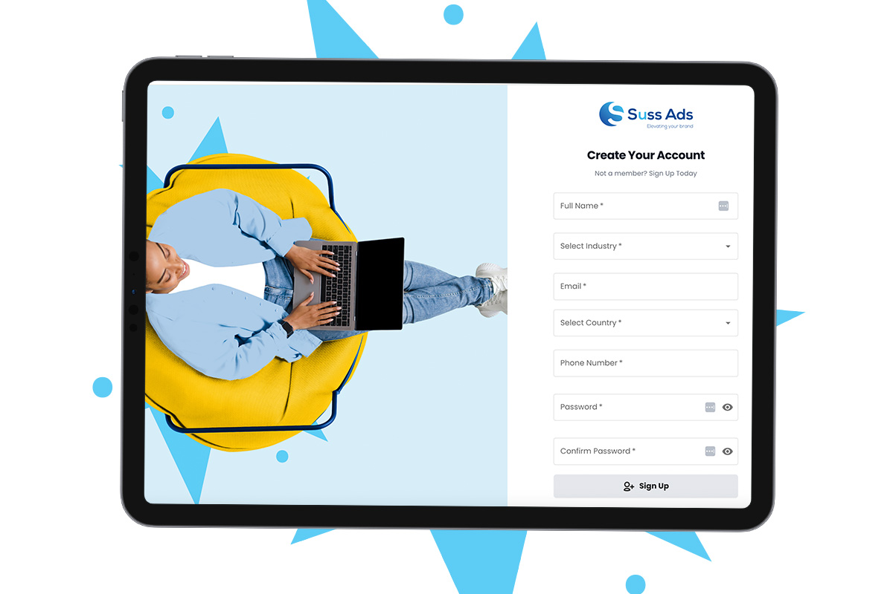
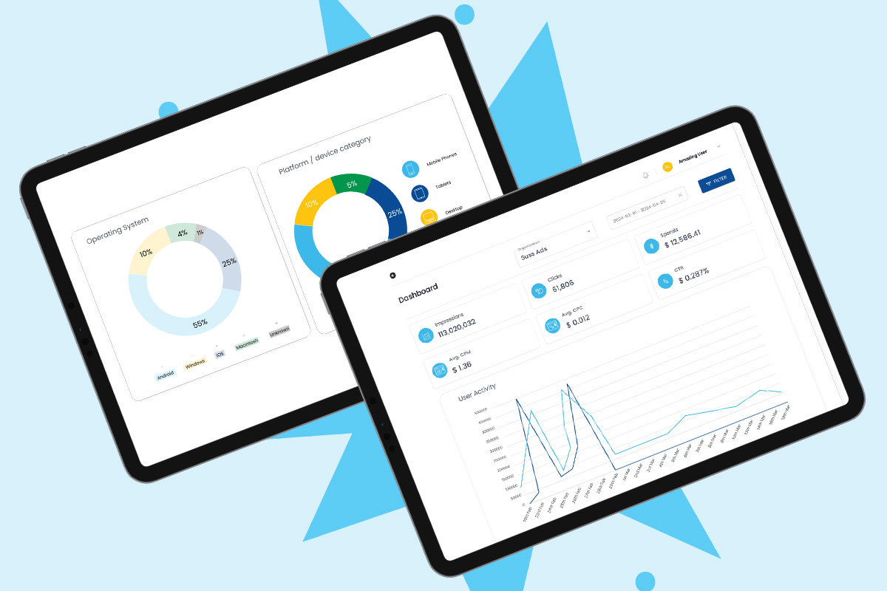
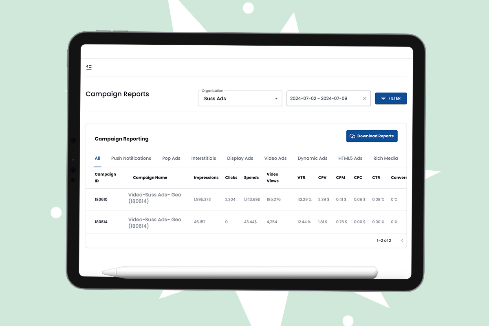
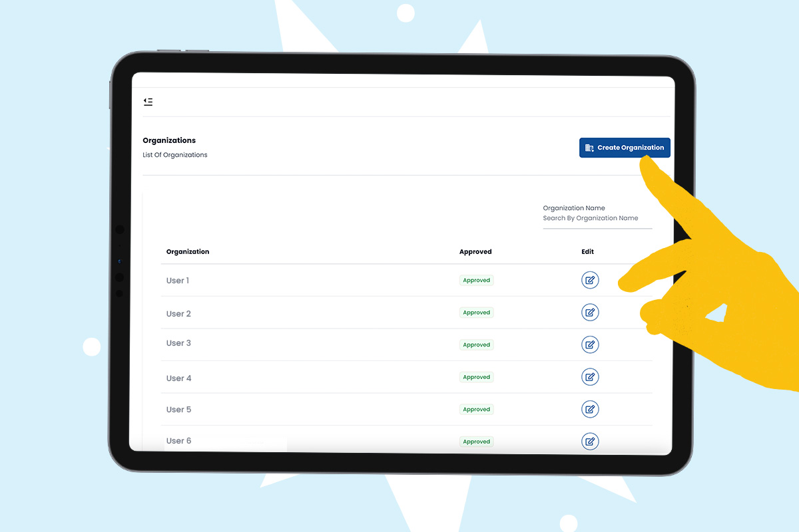
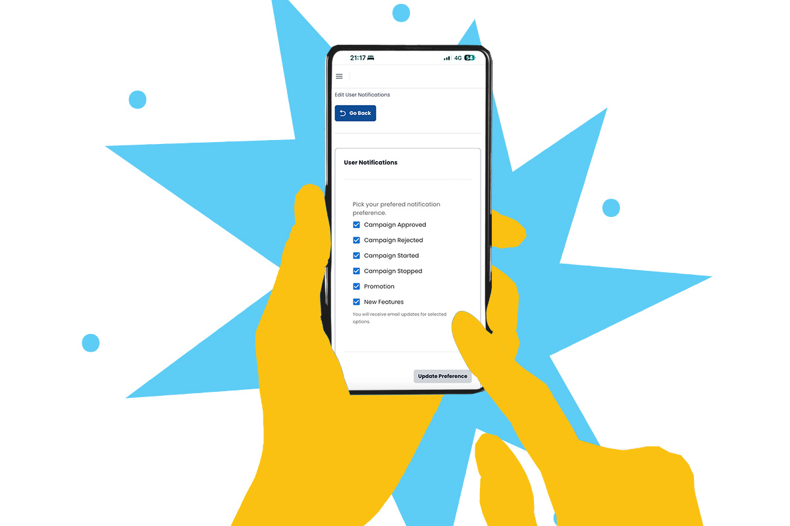
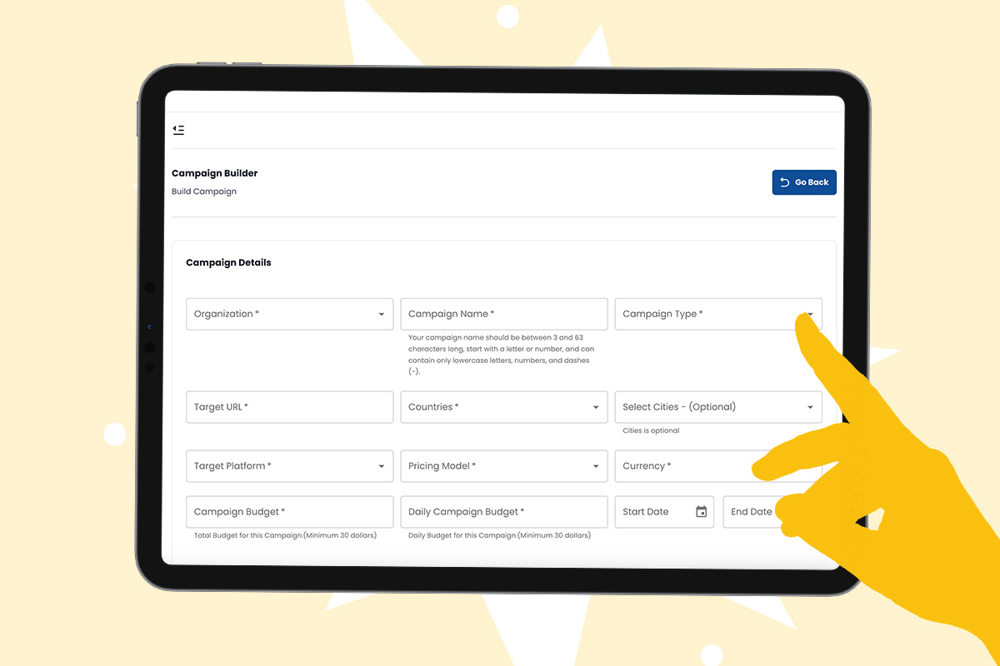

import authorImage from './dennis-soma.webp';
import coverImage from './SussDashboadPromoSocial.jpg';
import bodyImage from './SelfRegistrationWebsite.jpg';
import bodyImage1 from './CampaignChartsWebsite.jpg';
import bodyImage2 from './ComprehensiveReportsPageWebsite.jpg';
import bodyImage3 from './EnhancedCampaignBuildWebsite.jpg';
import bodyImage4 from './NotificationPageWebsite.jpg';
import bodyImage5 from './EnhancedCampaignBuildWebsite-1.jpg';

export const article = {
  date: '2024-07-11',
  title:
    'Launch of the Revamped Suss Ads 3.0 Programmatic Platform: Empowering Businesses with Advanced Features',
  coverImage: { src: coverImage },
  description:
    'Suss Ads has revamped its programmatic platform coinciding with the MarTech agency’s 3rd anniversary.',
  author: {
    name: 'Dennis Maina',
    role: 'Managing Partner',
    image: { src: authorImage },
  },
};

export const metadata = {
  title: article.title,
  description: article.description,
  openGraph: {
    images: '../../../public/images/blogs/SussDashboadPromoSocial.jpg',
  },
};

Suss Ads has revamped its programmatic platform coinciding with the MarTech agency’s 3rd anniversary.

Loaded with robust features, the Suss Ads Programmatic 3.0 is an upgraded edition aimed at revolutionizing campaign management experience with exceptional, seamless and intuitive interface.

**Self-Registration for Business and New Clients**

Say farewell to cumbersome onboarding procedures. With our new feature, signing up is a breeze, offering instant access to all the tools necessary to kickstart your campaigns and make an impact immediately.

**Detailed Campaign Performance Charts**

Are you prepared to view your campaign performance in a whole new light? Our interactive charts beautifully dissect essential metrics like impressions, clicks, conversions, and ROI. Embrace clear insights and bid farewell to guesswork. With this tool, spot trends, refine strategies, and optimize your Ad Spend with ease.

**Comprehensive Reports Page**

Centralize all your campaign data effortlessly. Our new Reports page serves as your centralized hub for generating comprehensive insights with just a few clicks. Whether you require a high-level summary or a deep-dive analysis, our customizable reports deliver exactly what you need. It's akin to having a dedicated Data Scientist available round-the-clock.

**Enhanced Campaign Build**

Creating campaigns is now seamless. Our enhanced Campaign Build feature simplifies the setup, targeting, and launch of your ads. With advanced targeting capabilities and creative tools at your disposal, reaching your target audience is faster than ever. Prepare to craft impactful campaigns that drive conversions effortlessly.

**Customizable Notification Settings Page**

Keep informed with our revamped Notification Settings page. Tailor your alerts to receive timely updates on performance, budget changes, or account activities. Stay on top of everything crucial to your operations, like having a dedicated assistant who ensures you're always informed and prepared to act.

**Organization Management Page**

Managing multiple accounts and team members has never been simpler. Our Organization Management page allows you to effortlessly add or remove team members, assign roles, and configure permissions with just a few clicks. Keep operations streamlined and ensure seamless collaboration across your team.

Discover how the enhanced Suss Ads Programmatic Platform can amplify your advertising endeavors. From streamlined self-registration to insightful performance charts, comprehensive reporting, intuitive campaign creation, customizable notifications, and efficient organization management – we offer all the tools necessary to elevate your campaigns to new heights. Explore these exciting features today and optimize your campaign management experience.

[**Schedule a demo now**](https://www.suss.co.ke/bookdemo?utm_source=website&utm_medium=blog&utm_campaign=sussat30&utm_id=suss+at+3) and receive a 10% bonus on your ad spend.
