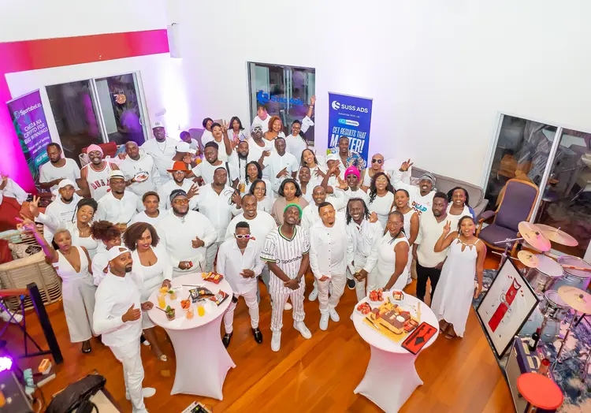
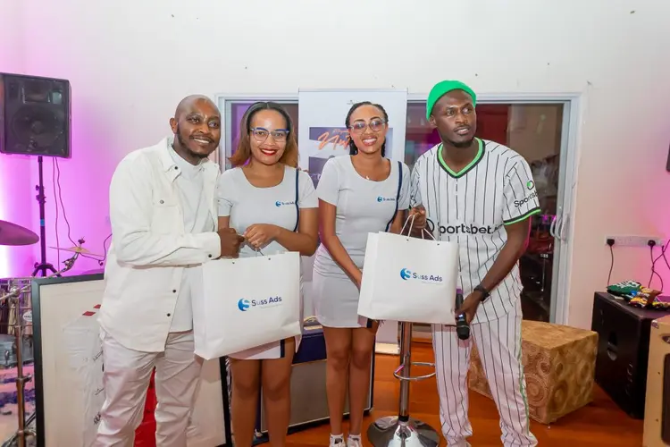

import authorImage from './dennis-soma.webp';
import coverImage from './kingkaka.webp';

export const article = {
  date: '2024-07-09',
  title:
    'Suss Ads partners with creative visionaries to forge a dynamic creative economy',
  coverImage: { src: coverImage },
  description:
    'In the fast-evolving realms of entertainment and digital marketing, partnerships blending creativity with strategic vision often leads to groundbreaking innovations and enduring impacts.',
  author: {
    name: 'Dennis Maina',
    role: 'Managing Partner',
    image: { src: authorImage },
  },
};

export const metadata = {
  title: article.title,
  description: article.description,
  openGraph: {
    images: '../../../public/images/blogs/kingkaka.webp',
  },
};

One such collaboration is between **Kaka Empire**, a leading music label in Kenya under the visionary leadership of King Kaka, and **Suss Ads**, a leading marketing and communication agency recognized for pioneering digital advertising solutions.

Together, they have not only reshaped the landscape of content creation and distribution but also contributed significantly to the growth of the creative economy in Africa.

Founded by Kennedy Ombima, known as **King Kaka** and **Dennis Njenga**, Kaka Empire has solidified its position in Kenya's music industry by nurturing local talent and producing chart-topping hits. Beyond music, the label fosters a culture of creativity and entrepreneurship among artists, expanding its influence into events, merchandise, and multimedia content creation.

In contrast, Suss Ads has emerged as a dominant force in digital advertising and communication strategies, specializing in innovative solutions tailored to the African market. Their expertise has enabled numerous brands to enhance reach and engagement through cutting-edge campaigns across diverse digital platforms.

The partnership between Kaka Empire and Suss Ads stems from a shared vision to harness creativity for economic growth. King Kaka's belief in unique innovations and compelling messaging resonated with Suss Ads, whose digital prowess complemented Kaka Empire's creative strengths.

The partnership's first major initiative was 'The Coliseum,' a groundbreaking project designed to empower the creative economy.

"_The Coliseum was a unique product tailored for the creative economy. It wasn't just about music; it was about creating a platform where artists and creators could thrive. Suss Ads not only sponsored the event but also played a crucial role in organizing and promoting it,_ "King Kaka says.

One of the standout features of the Kaka Empire-Suss Ads partnership has been their innovative approach to content distribution and audience engagement.

Suss Ads introduced Kaka Empire to cutting-edge digital advertising techniques, including targeted social media campaigns, interactive content formats, and personalized messaging strategies.

“_These efforts not only enhanced the visibility of our artists but also fostered deeper connections with fans across Africa and beyond. We have seen tremendous growth in our reach and engagement,_" King Kaka acknowledges Suss Ads' unique innovations.

King Kaka and Dennis Njenga reflection on their partnership with Suss Ads:

<iframe
  width="100%"
  height="400px"
  src="https://www.youtube.com/embed/ixgvljE1Br4"
  frameBorder="0"
  allowFullScreen
></iframe>

Beyond immediate successes, the Kaka Empire-Suss Ads collaboration has emphasized the importance of building robust structures within the creative economy.

"_It's not just about creativity; it's about building sustainable frameworks that attract investments and support long-term growth, Suss Ads' strategic insights have been invaluable in this regard, helping us streamline operations, improve audience targeting, and explore new revenue streams,_” King Kaka says.

Dennis Maina, Managing Partner of Suss Ads, recognizes that the partnership between Kaka Empire and Suss Ads goes beyond mere business collaboration; it represents a shared dedication to pushing boundaries and effecting meaningful change within the creative industry.

"_This partnership showcases the transformative impact of collaboration and innovation on advancing the creative economy. Our shared vision and commitment to excellence have not only revolutionized content creation and distribution but also established new benchmarks for industry collaboration across Africa and beyond._,” says Mr Maina.

Dennis Njenga, the Co-Founder of Kaka Empire emphasizes their belief in unique innovation and ideas as a music label. He highlights how partnering with Suss Ads has empowered them to realize these ideas, enabling unique audience engagement through digital ads, bulk SMS, and event promotion.

"_From digital advertising to event management, Suss Ads has been instrumental in our success,_" says Njenga.

King Kaka reveals that as they prepare to enter new markets and pursue new opportunities, Suss Ads will remain pivotal in assisting them to realize their ambitious growth objectives.
