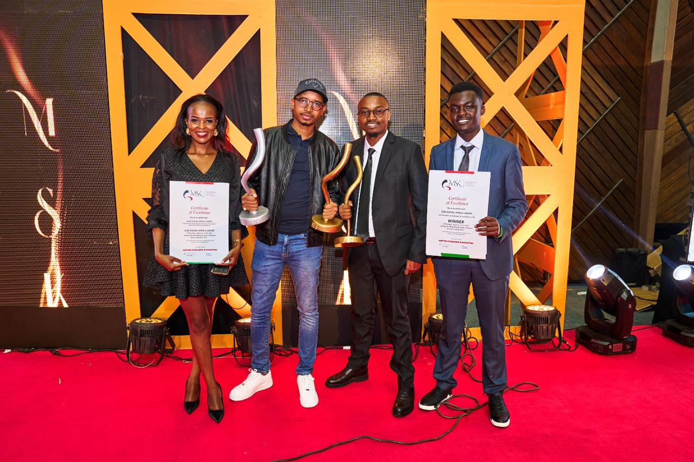

import coverImage from './msk-awards-suss.jpg';
import authorImage from './dennis-soma.webp';

export const article = {
  date: '2023-12-17',
  title:
    'Innovation and Excellence: Suss Digital Africa Celebrates Big Wins at MSK Gala',
  coverImage: { src: coverImage },
  description:
    'Suss Digital Africa shines at the Marketing Society of Kenya Awards Gala, securing Best Agency of the Year and Best Media Innovation of the Year, marking its second anniversary with unparalleled success',
  author: {
    name: 'Dennis Maina',
    role: 'Managing Partner',
    image: { src: authorImage },
  },
};

export const metadata = {
  title: article.title,
  description: article.description,
  openGraph: {
    images: '../../../public/images/blogs/msk-awards-suss.jpg',
  },
};

The crowning achievement of the night was undoubtedly the “Best Agency of the Year Award,” a testament to Suss Digital’s dedication, creativity, and impact on the digital marketing landscape. The agency’s commitment to excellence and its ability to deliver exceptional results were recognized and rewarded, solidifying its position in the industry.

But wait, there’s more! Suss Ads snagged the “Best Media Innovation of the Year” award for its innovative approach to media strategies, targeting, distribution of content, monitoring and reporting through its locally owned self-serve programmatic solution. They didn’t just break the mold; they melted it, reshaped it, and threw in a dash of Kenyan spice.

The acknowledgment of their groundbreaking media innovations positions Suss Digital as a trailblazer in the industry, setting new standards for innovation, creativity and effectiveness. Suss Digital isn’t just about winning awards; they’re rewriting the playbook. Their self-serve programmatic solution has been making waves, serving over 50 brands across 54 global markets in the last two (2) years.

In the B2B arena, Suss Digital demonstrated its strategic acumen by securing the “B2B Marketing Strategy of the Year” award as the 1st Runner-Up. This recognition underscores the agency’s ability to craft and execute targeted, impactful strategies tailored to the unique dynamics of business-to-business marketing.

Furthermore, Suss Digital’s excellence extended to the implementation and distribution realm, earning them the 1st Runner-Up position in the “Best Distribution and Implementation of the Year” category. This award is a testament of the agency’s proficiency in translating strategic visions into tangible, effective campaigns that reach and resonate with the intended audience.

And here’s the cherry on top; Dennis Maina, the brains behind Suss Ads, got the nod for the “Marketer of the Year Award” as the 1st Runner-Up. It’s not just about marketing; it’s about a visionary leader steering the ship toward greatness.

As the confetti settles, Suss Digital Africa tips its hat to stakeholders and clients, the real MVPs. The awards are a testament to the trust and collaboration that makes Suss Digital a powerhouse. And guess what? This is just the beginning. Suss Digital Africa is here to stay, turning heads, and rewriting the rules. Cheers to two years of awesomeness, Suss Digital Africa!

The team at Suss Digital Africa expressed immense gratitude to their stakeholders and clients, acknowledging the pivotal role they played in the agency’s success. Some of the top brands that Suss Digital has served include the Government of Kenya (E-Citizen), Kenya Revenue Authority (KRA), Bio Foods Ltd, SportPesa, Betika, Unilever, LG, Huawei, Hanaan, Girl Effect, Mozilla and Udemy, among other brands. The awards serve as a testament to the collaborative spirit and unwavering belief that clients and stakeholders have in Suss Digital’s ability to deliver exceptional results.

As the agency reflects on this momentous occasion, celebrating not only its award-winning achievements but also its second anniversary, it is evident that Suss Digital Africa is poised for continued success. The recognition garnered at the Marketing Society of Kenya Gala Awards solidifies Suss Digital’s status as a leading force in the marketing industry, and the team looks forward to building on this success in the years to come. Congratulations to Suss Digital Africa on a remarkable journey and a night to remember!
