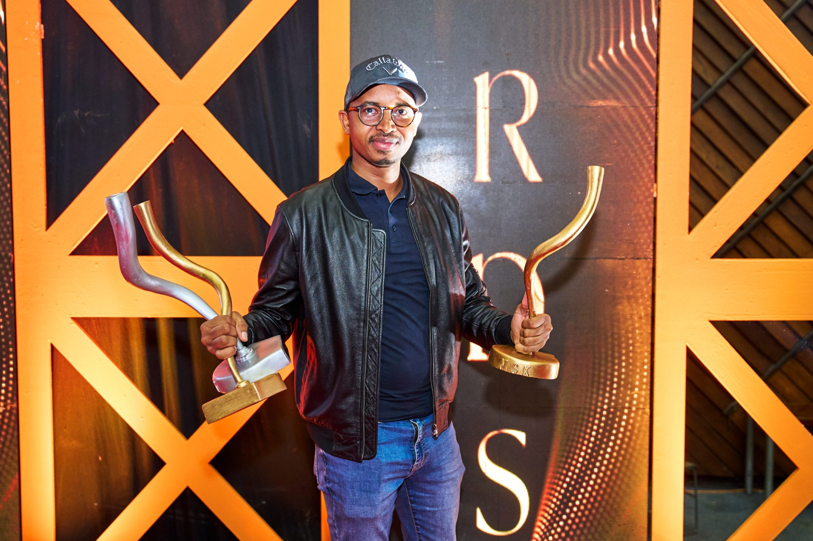

import authorImage from './dennis-soma.webp';
import coverImage from './Dennis-Maina-MSK-Award.jpg';

export const article = {
  date: '2023-12-17',
  title: 'Suss Digital Africa Triumphs',
  coverImage: { src: coverImage },
  description:
    'The Founder of the digital marketing agency, Dennis Maina, has been named among the Top 25 Men in Digital by the SOMA Awards 2023 After the agency’s MSK Gala Award Sweep.',
  author: {
    name: 'Dennis Maina',
    role: 'Managing Partner',
    image: { src: authorImage },
  },
};

export const metadata = {
  title: article.title,
  description: article.description,
  openGraph: {
    images: '../../../public/images/blogs/Dennis-Maina-MSK-Award.jpg',
  },
};

The Founder of the digital marketing agency, Dennis Maina, has been named among the Top 25 Men in Digital by the SOMA Awards 2023 After the agency’s MSK Gala Award Sweep.

At the MSK annual awards ceremony, Suss Digital Africa won five prestigious awards, including Best Agency of the Year (2023) and Best Media Innovation. Dennis Maina was also recognized as the First Runners-Up for Best Marketer of the Year.

The agency’s success can be attributed to the Suss Ads Programmatic Platform, a full-stack demand-side platform developed by a team of Kenyan developers. The platform serves over 50 brands in more than 54 markets across diverse sectors, including Banking, Finance, Technology, Government, Education, Gaming, and FCMG. Its innovative ad formats and precise targeting capabilities have set it apart in the competitive digital marketing landscape.

Maina expressed his gratitude and credited the agency’s success to the dedicated Suss Digital team, clients, and partners. He said, “In the ever-changing digital world, Suss Digital Africa is driven by innovation and creativity. We’re thrilled to be recognized for our significant contributions. This has been an amazing year for us, marked by the celebration of our 2nd Anniversary and the honor of winning multiple awards. It means there is something are doing right.”
Because choosing a JS runtime was one of the only areas where a developer wasn’t paralysed with choice, in early 2020, the creator of Node gave us something new to agonise over. The launch of Deno and Bun heralded the final mutation of JavaScript into a language that can truly run anywhere it wasn’t intended to.

The founder’s inclusion in the Top 25 Men in Digital aligns with the increasing impact of local innovation on the global digital stage. The Men in Digital platform serves as a forum for entrepreneurs, inventors, and business leaders to engage in discussions on advancing digital technologies. Similarly, a parallel platform for women is available to foster connections and provide opportunities for career advancement and networking within the digital ecosystem.
As Kenya continues to make strides in the digital landscape, individuals like Maina and agencies like Suss Digital Africa play a pivotal role in shaping the industry’s future, bringing innovation, creativity, and recognition on both national and international levels.
