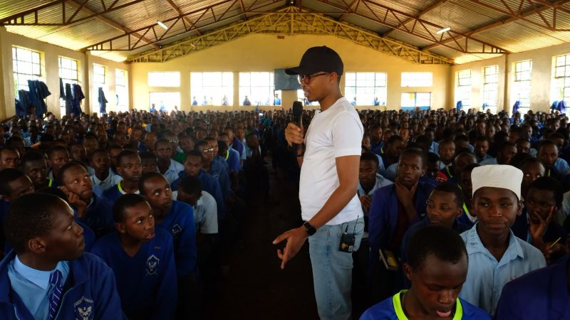

import authorImage from './dennis-soma.webp';
import coverImage from './coverImage.jpeg';
import bodyImage from './bodyImage.jpeg';

export const article = {
  date: '2024-06-30',
  title: 'Students benefit from the Suss NextGen Program.',
  coverImage: { src: coverImage },
  description:
    'Suss Ads, a leading Marketing and Technology (MarTech) Agency has launched the Suss NextGen Program, a national initiative aimed at empowering students across high schools and tertiary institutions with essential tech-led platforms, knowledge, resources, and opportunities crucial for thriving in todays digital world.',
  author: {
    name: 'Dennis Maina',
    role: 'Managing Partner',
    image: { src: authorImage },
  },
};

export const metadata = {
  title: article.title,
  description: article.description,
  metadataBase: new URL('https://www.suss.co.ke/'),
  openGraph: {
    images: '../../../public/images/blogs/coverImage.jpeg',
  },
};

Suss Ads, a leading Marketing and Technology (MarTech) Agency has launched the Suss NextGen Program, a national initiative aimed at empowering students across high schools and tertiary institutions with essential tech-led platforms, knowledge, resources, and opportunities crucial for thriving in today's digital world.

**Githumu Boys High School** is among the pioneering schools to benefit from the program, securing a total commitment of half a million for the revitalization of their tech lab. As part of this initiative, Suss Ads has initiated a donation of Sh100,000.

**Dennis Maina**, the Managing Partner of Suss Ads and an alumnus of Githumu High School highlighted that their donation exemplifies their belief in the transformative power of education and innovation.

_"Recognising the pivotal role of technology in modern education, we are embarking on a journey to equip students with the tools they need to excel in an increasingly digital landscape,"_ he states.

**Mr Vincent Mutuku**, Deputy Principal at Githumu Boys, expressed that the assistance received in providing computers will greatly facilitate student learning, addressing previous challenges of inadequate computer access.

Mr Maina's objective is to close gaps in technology access and educational opportunities while empowering the next generation digitally.

**James Omollo**, a student, commended the efforts of the school alumni, describing it as a significant example for all students. He further noted that it served as motivation, particularly knowing that one of the former students is among Africa's youngest entrepreneurs.

As Suss Ads commemorates its third anniversary Mr Maina expressed gratitude for the collaborations and partnerships that have fuelled the agency's growth and influence, envisioning a future where every student thrives in a digitally interconnected environment.

Here’s the video highlighting the Suss NextGen Program initiative:

<iframe
  width="100%"
  height="400px"
  src="https://www.youtube.com/embed/AIzuUBLGmRU"
  frameborder="0"
  allow="accelerometer; autoplay; clipboard-write; encrypted-media; gyroscope; picture-in-picture"
  allowfullscreen
></iframe>
