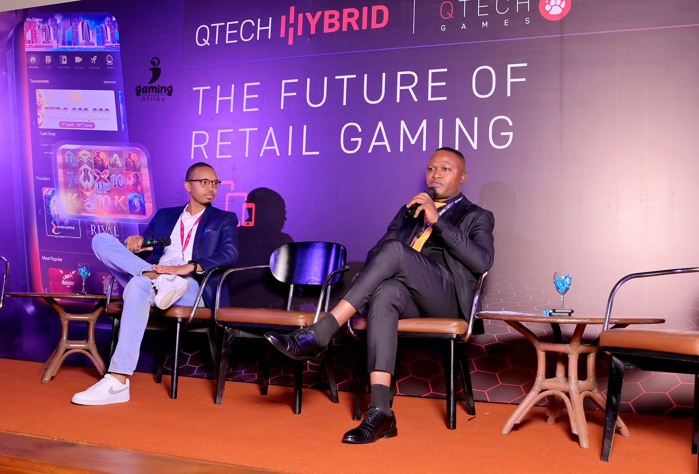
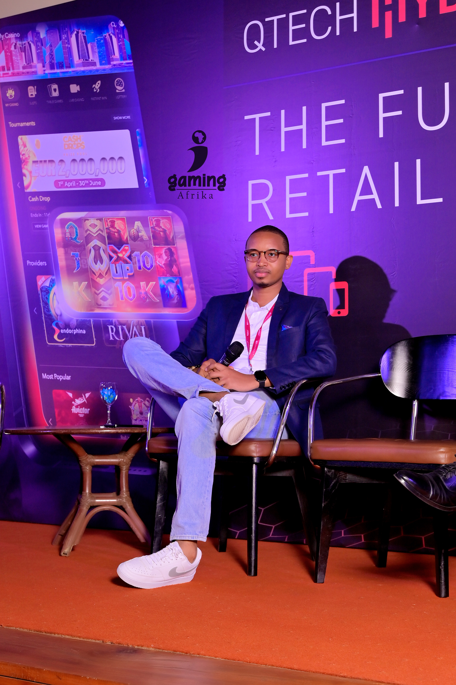

import authorImage from './dennis-soma.webp';
import coverImage from './image1.jpg';
import bodyImage from './image2.jpg';

export const article = {
  date: '2024-07-17',
  title:
    'The Evolution & State of the iGaming Industry in Africa: Digital Innovation, the Youth and their Significance',
  coverImage: { src: coverImage },
  description:
    'The 9th Annual Sports Betting East Africa (SBEA+) Summit, held in Uganda, kicked off with an energetic tribute to the diversity and innovation thriving in the iGaming industry.',
  author: {
    name: 'Dennis Maina',
    role: 'Managing Partner',
    image: { src: authorImage },
  },
};

export const metadata = {
  title: article.title,
  description: article.description,
  openGraph: {
    images: '../../../public/images/blogs/213.JPG',
  },
};

The 9th Annual Sports Betting East Africa (SBEA+) Summit, held in Uganda, kicked off with an energetic tribute to the diversity and innovation thriving in the iGaming industry.

Distinguished industry leaders, among them Suss Ads Managing Partner Dennis Maina, gathered to discuss and strategize ways to foster inclusivity and expand opportunities in the iGaming and sports betting sectors.

During the Summit, Mr Maina addressed the struggles young African men encounter after completing their education, finding themselves confronted with a harsh reality divergent from their initial aspirations. He highlighted pervasive advertisements promising fast wealth through mobile money schemes and forex trading, despite high initial deposits beyond many's financial means.

Nevertheless, mobile phones, the internet and digital products have opened endless possibilities and opportunities across various industries, among them offering access the rapidly expanding iGaming industry. He also elaborated on Suss Digital Media's proficiency in navigating this sector and emphasized their increasing partnerships with betting brands across Africa.

Among the key points he highlighted at the Summit were;

**The growth of the betting industry.**

Over the past decade, the I-gaming industry in Africa has seen exponential growth, with projections indicating it will reach $1.85 billion by 2024 and surge to $2.5 billion by 2029 (Statista). This growth is significantly driven by technological advancements, especially the widespread adoption of mobile devices. Countries such as Kenya exemplify this trend, benefiting from high connectivity rates that have expanded access to betting across a broader demographic.

**Understanding the Male-Dominated Betting Space.**

The betting industry is predominantly driven by young men aged 18–25, attracted by the promise of financial gain. Despite some female representation in marketing, gender diversity is lacking. Ethical concerns include responsible advertising and engagement practices, especially for vulnerable demographics like young men. Effective regulatory frameworks are essential across African nations to protect consumers and promote fair play, shaping industry operations and consumer behaviours significantly.

**Economic and social implications.**

Betting serves as a financial tool for many young individuals who use betting platforms akin to quasi-bank accounts for saving and making small transactions. The taxation of betting activities also plays a beneficial role in bolstering government revenues, which in turn support critical societal infrastructure and future investments. Moreover, there is potential for platforms to expand their infrastructure to offer additional financial services beyond gambling, thereby enhancing their utility and societal impact.

**Future Trends and Sustainable Growth.**

By leveraging data analytics, the iGaming industry anticipates player preferences for continuous engagement. Emphasizing social responsibility through initiatives like education support fosters positive community integration, enhancing corporate reputation and contributing positively to local communities, aligning business success with meaningful social impact.

**Strategies for Growth and Inclusivity.**

Introducing flexible interfaces for multifunctional betting wallets can reduce stigma and boost practicality, making iGaming platforms more appealing to a wider audience. Aligning with youth interests in music, art, and fashion deepens connections with betting brands, resonating culturally and reinforcing brand relevance. Moreover, offering frequent, smaller rewards alongside the potential for substantial jackpots enriches emotional engagement, fostering stronger connections between users and the I-gaming experience.

**The Role of M-Pesa and Instant Gratification.**

M-Pesa has revolutionized financial transactions with its instant accessibility and convenience, paralleling the instant gratification sought in betting. It represents a paradigm shift in daily financial management, seamlessly integrating into everyday life to provide practicality and joy. This underscores its cultural and economic impact, highlighting it as a pivotal example of technology-driven empowerment in the digital age.

**The Betting Industry’s Potential Beyond Gambling.**

Betting platforms have the potential to become essential parts of users’ lives by expanding their services to support broader financial and social needs. Aligning with youth values, such as addressing climate change, not only resonates with their beliefs but also fosters long-term brand loyalty and engagement. This strategic alignment allows platforms to meaningfully integrate into users' lifestyles while contributing positively to societal and environmental causes.

**Strategic Approaches: Enhancing iGaming Promotion.**

In the competitive iGaming industry, success hinges on strategic digital marketing and influencer partnerships. Digital marketing drives audience engagement and conversions, enhancing visibility across platforms. Collaborating with influencers who resonate with the iGaming community boosts brand credibility and expands reach, fostering trust and long-term customer relationships crucial for sustained growth.

**Leveraging Data Analytics for Enhanced Customer Engagement and Loyalty.**

Data analytics in iGaming boosts conversion rates enhances satisfaction and encourages repeat purchases. By collecting and segmenting data for personalized marketing, companies cater to individual preferences, improving overall performance. Continuous customer feedback optimizes offerings. Transparency, fairness, excellent service, and rewarding loyalty programs foster trust and ensure sustained growth in this competitive industry.

**Streamlining Operations and Embracing Efficiency.**

To achieve operational excellence in iGaming, it's crucial to streamline operations to reduce costs and improve efficiency. This involves optimizing processes across various departments, leveraging technology for automation, and implementing lean management principles. From a marketing and media buying perspective, efficiency can be enhanced through data-driven decision-making, strategic budget allocation, and maximizing ROI on advertising spend.

**Adapting to Market Changes and Continuous Improvement.**

Adapting to iGaming's dynamic environment requires agility amid market shifts and regulatory changes, such as potential tax hikes affecting Kenyan marketers. Resilience strategies include fostering continuous learning, agile project management, and proactive adaptation to regulations. Start-ups must prioritize MVP strategies, iterate based on user feedback, and scale operations sustainably amidst competitive pressures.

**Brand Localization and Global Integration Challenges.**

Addressing brand localization challenges in iGaming entails balancing international brand standards with local market dynamics. Avoiding the pitfalls of a one-size-fits-all strategy, successful approaches involve tailoring marketing efforts to cultural nuances, collaborating closely with local teams, and respecting regulatory landscapes to foster sustainable growth and success in diverse markets.

**In Conclusion;**

Mr Maina highlighted the importance of strategic partnerships and market insights for expanding the African betting sector. Emphasizing inclusivity and user-friendly digital experiences for Gen Z and millennials drives industry growth. Key actions include integrating digital payments into betting platforms, promoting non-betting transactions, and collaborating on youth-oriented content with cultural figures. Initiatives like supporting M-Pesa and addressing agriculture, climate change, and social causes aim to bolster economic and social contributions, benefiting local communities and society at large.
