import authorImage from './dennis-soma.webp';
import coverImage from './allSpeakers.jpg';

export const article = {
  date: '2024-10-15',
  title:
    'Empowering Youth Through Mental Health Awareness: Insights from the Suss NextGen Program at Thika High School',
  coverImage: { src: coverImage },
  description:
    'As the global conversation surrounding mental health intensifies, the Suss NextGen program stands out as a beacon of hope for young individuals grappling with psychological challenges.',
  author: {
    name: 'Dennis Maina',
    role: 'Managing Partner',
    image: { src: authorImage },
  },
  ogImageUrl: './allSpeakers.jpg',
};

export const metadata = {
  title: article.title,
  description: article.description,
  metadataBase: new URL('https://suss.co.ke'),
  openGraph: {
    siteName: 'Suss',
    type: 'website',
    title: article.title,
    description: article.description,
    url: 'https://suss.co.ke/blog/the-role-of-mental-health-awareness-in-empowering-youth',
    images: [
      {
        url: article.ogImageUrl,
        width: 1200,
        height: 630,
        alt: 'Cover Image',
      },
    ],
  },
};

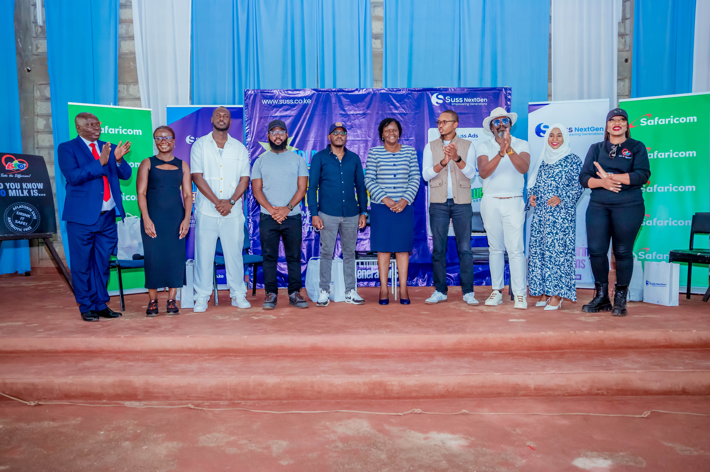

_Last week, the world marked Mental Health Day, and the focus on youth mental health has never been more critical. This issue affects not just individuals but entire communities._

The **Suss NextGen** program recently visited **Thika High School** to raise mental health awareness. In partnership with key leaders, the program aimed to equip students with tools to handle modern challenges.

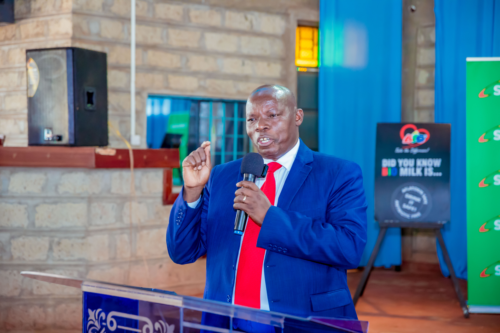

According to the **World Health Organization**, one in six young people globally faces a mental disorder. Many don’t receive the help they need. Factors like school pressure, social media, and family stress are fueling rising levels of anxiety and depression, impacting individuals, families, and schools.

#### Building a Support System

**Suss NextGen** focuses on creating a support system for students. It partners with leaders to offer mental health education, workshops, and open discussions. The goal is to break the stigma, encourage seeking help, and foster peer support.

**Dennis Maina**, Managing Partner at Suss Ads, highlighted the urgency of these efforts:

> Our youth face unprecedented challenges, and we must provide them with the necessary tools and support. Mental health education is not just an option; it is essential for a thriving future.

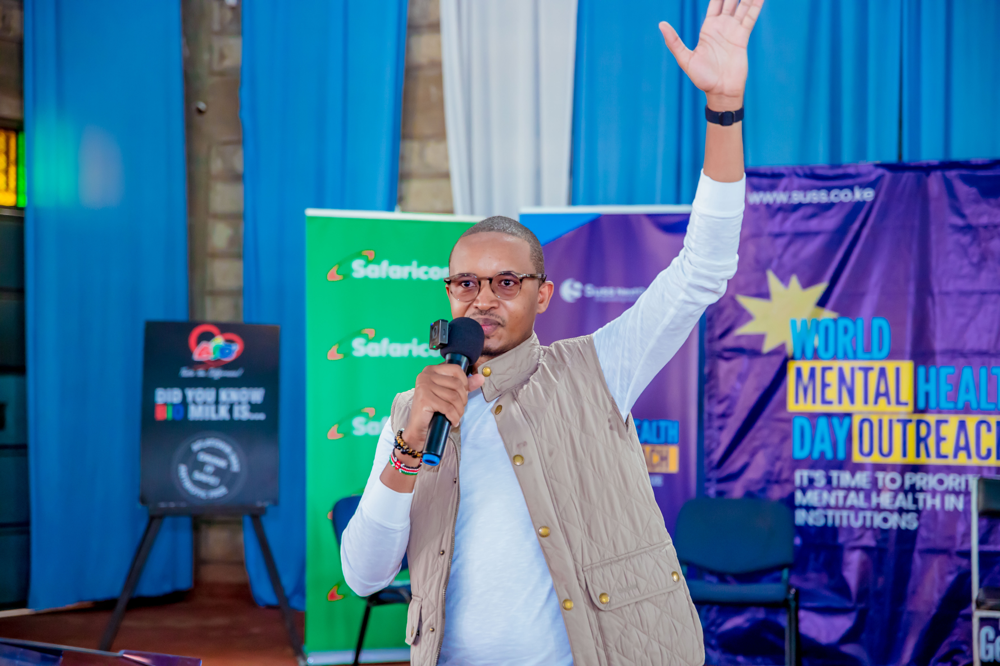

Dennis Maina drew from his own experiences, envisioning **Suss NextGen** as a way to build resilience and mental strength in young people.

#### Panel of Influential Speakers

The event featured a panel of influential speakers, including **Lady Justice Lydia Achode**, **Dr. Sumeiya Ahmad**, and **Zizwe Awour Vundla**. The session was moderated by media personality **Azeezah Hashim**.

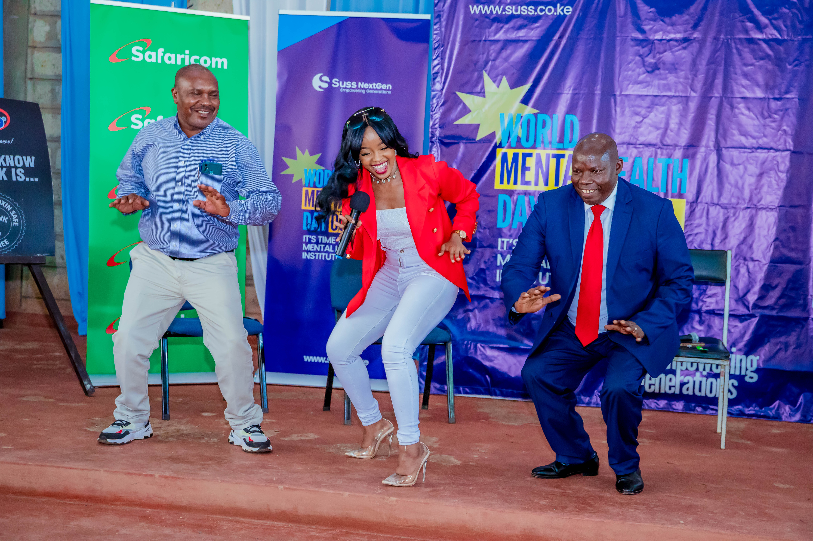

Lady Justice Lydia Achode discussed the connection between mental health and responsible citizenship. She explained that mental wellness impacts how people follow laws and contribute to society:

> The Kenyan Constitution guarantees the right to mental health. Historically, mental health has been stigmatized, leading to serious crimes by individuals with untreated conditions.

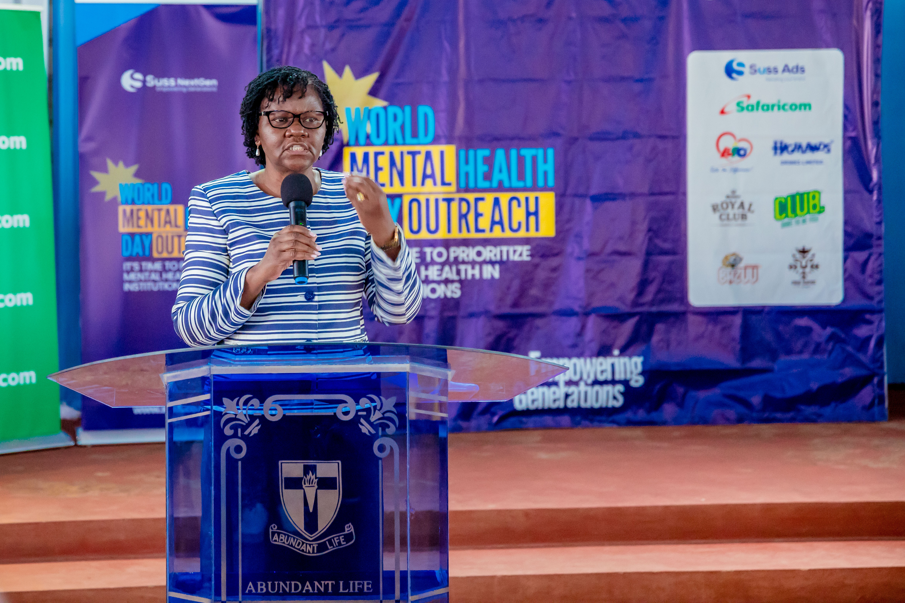

Justice Achode stressed early intervention and communication, urging students to ask for help and discussing how faith can help cope with mental struggles:

> I encourage everyone to prioritize mental well-being as a step toward becoming responsible citizens and contributing positively to society.

The workshops were led by mental health professionals who taught students how to identify distress, manage stress, and know when to seek help.

**Dr. Sumeiya Ahmad**, a psychiatrist at **Chiromo Hospital**, emphasized the need for safe spaces for youth:

> "Engaging with the students at Thika High School reaffirmed the need for safe spaces where they can express themselves and gain emotional strength."

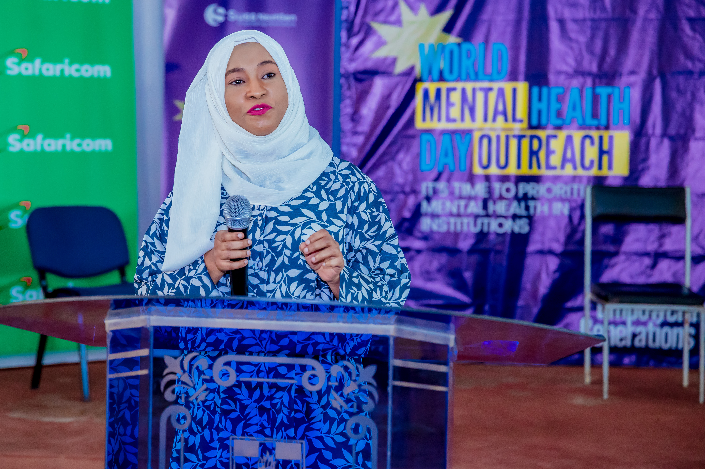

**Zizwe Awuor Vundla**, Director of Brand and Marketing at Safaricom PLC, found the outreach efforts to be impactful. She emphasized the need to help students cope with challenges and grow:

> The outreach was very impactful. We need to ensure that students are given the right tools and support to handle the difficulties they face today.

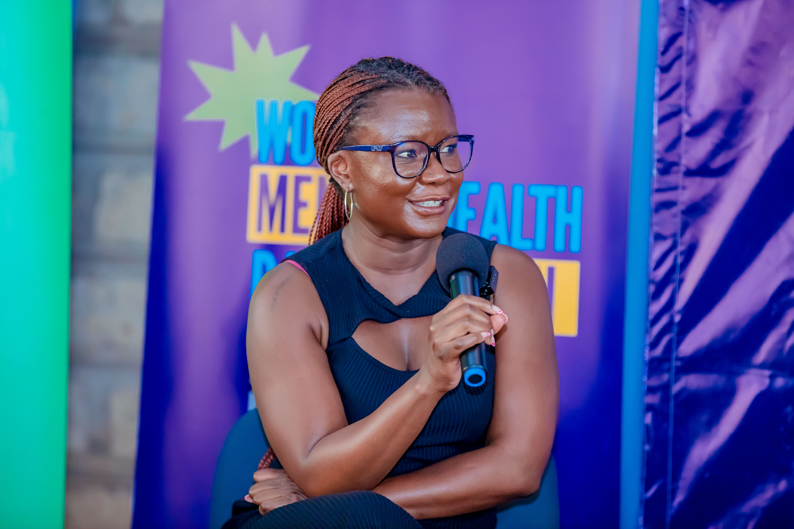

Suss NextGen also involves the broader community. Local leaders, teachers, and parents are encouraged to participate in mental health discussions. According to **Dennis Maina**:

> Building a supportive community empowers students to speak up about their struggles.

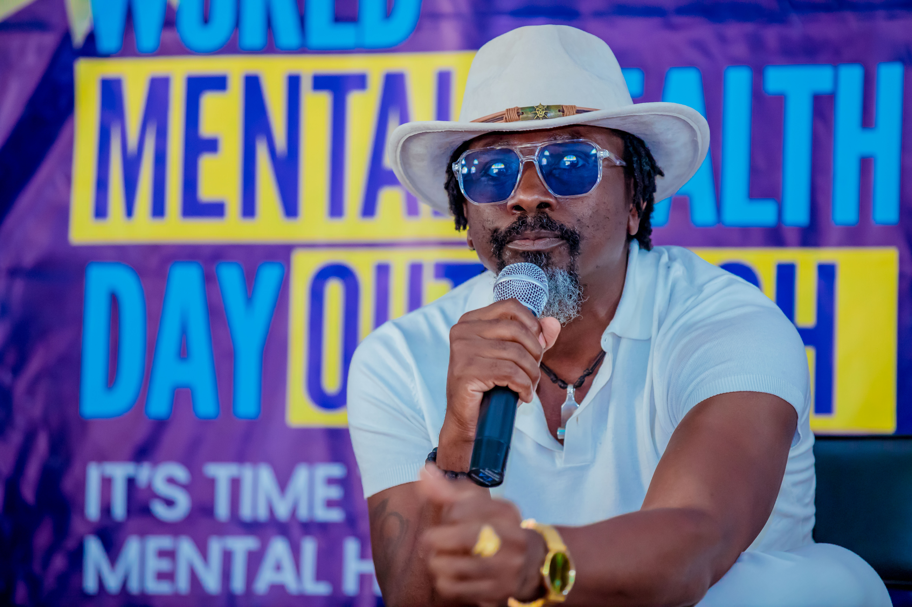

The program also involved **Sieka Gatabaki**, the Programs Director at **Mercy Corps**, as part of its outreach to the local community.

---

The **Suss NextGen** initiative is making a difference by helping students and the community understand mental health, encouraging them to speak up, and providing them with the tools to cope with the challenges they face today.

---

##### Featured Speakers

- **Anthony Muhoro** - Senior Software Engineer, Microsoft
  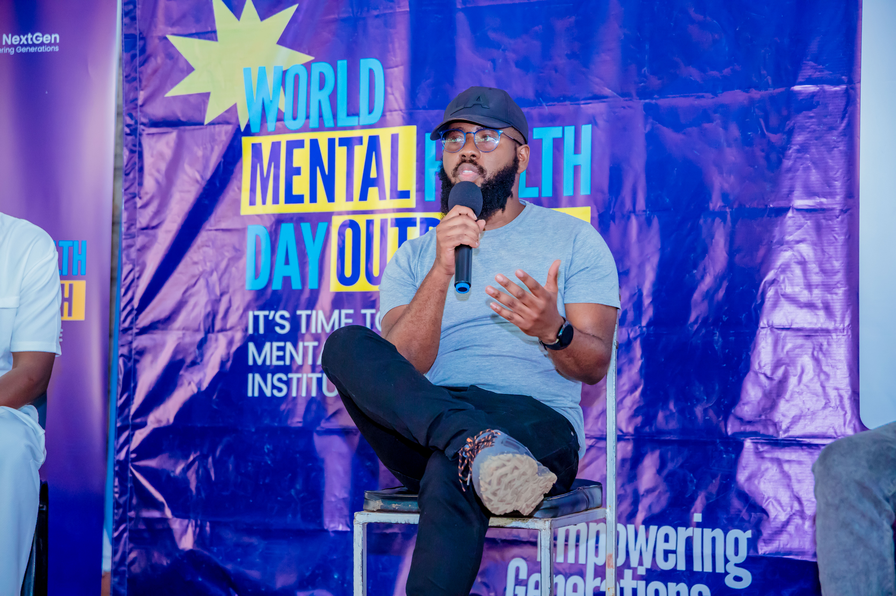

- **Dennis Njenga** - Managing Partner & Co-Founder, Kaka Empire
  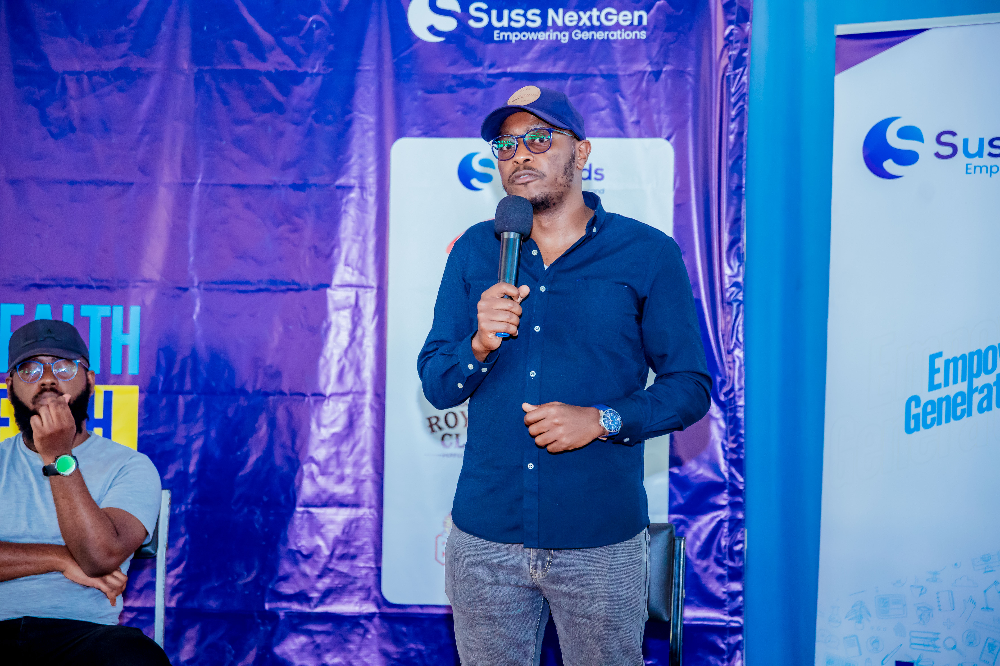

- **King Kaka** - Award-Winning Artist & Entrepreneur, Kaka Empire
  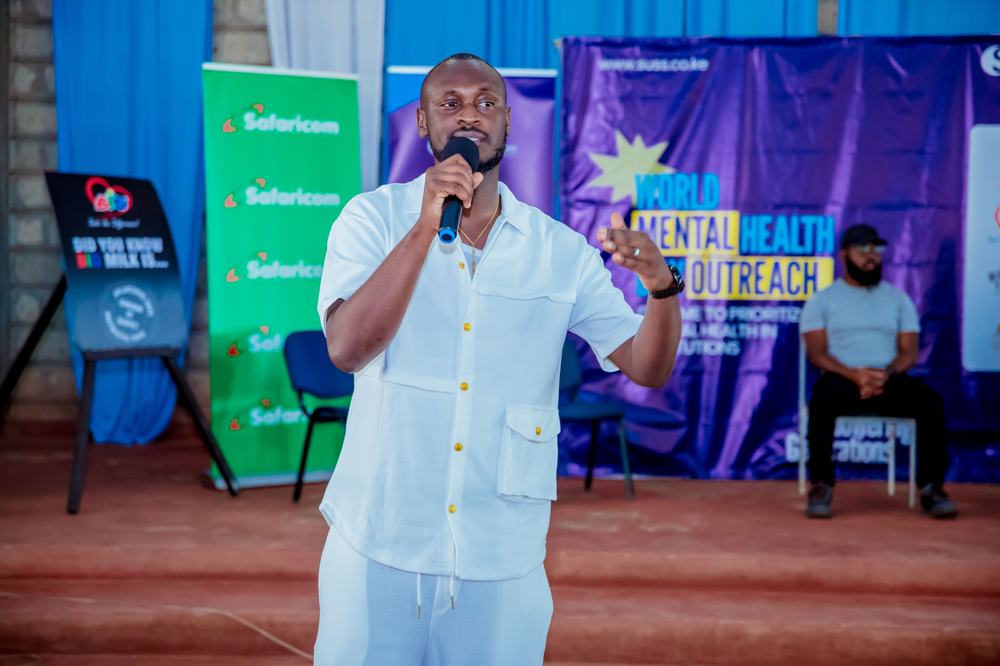

- **Waithera Ng'ang'a** - Strategic Partnerships & Corporate Communications Director, Bio Food Products Ltd
  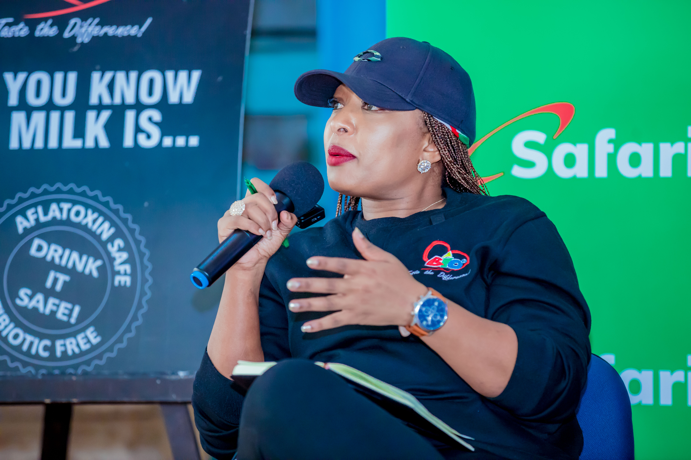

---
