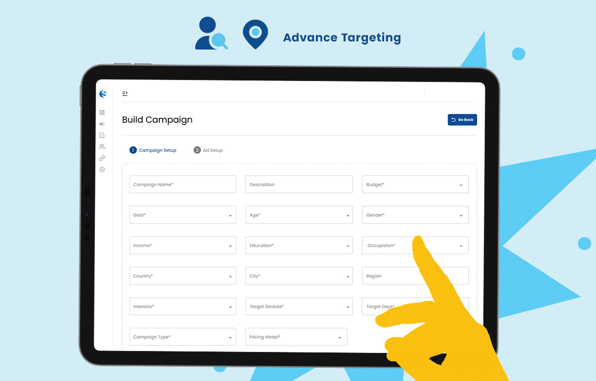
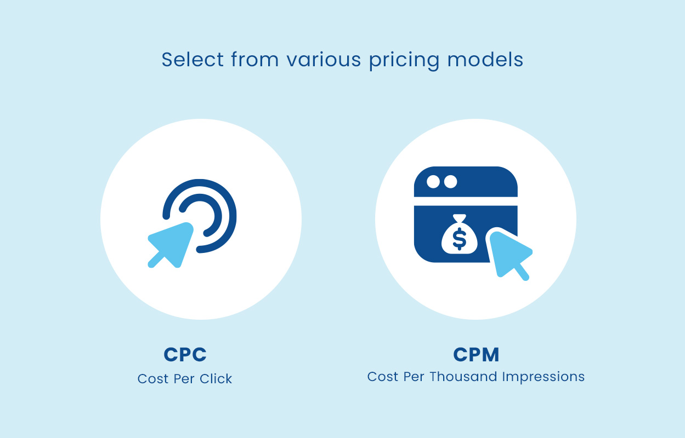
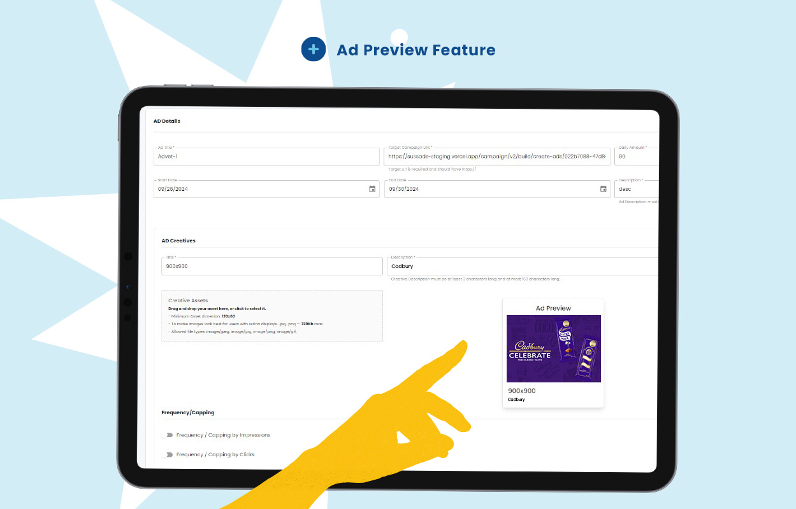

import authorImage from './dennis-soma.webp';
import coverImage from './campaign_builder_cover.jpg';

export const article = {
  date: '2024-09-26',
  title: 'Transform Your Marketing with Suss Ads Campaign Builder',
  coverImage: { src: coverImage },
  description:
    'Introducing the Campaign Builder a new feature from Suss Ads designed to simplify and enhance digital advertising campaigns.',
  author: {
    name: 'Dennis Maina',
    role: 'Managing Partner',
    image: { src: authorImage },
  },
  ogImageUrl: './campaign_builder_cover.jpg',
};

export const metadata = {
  title: article.title,
  description: article.description,
  metadataBase: new URL('https://suss.co.ke'),
  openGraph: {
    siteName: 'Suss',
    type: 'website',
    title: article.title,
    description: article.description,
    url: 'https://suss.co.ke/blog/transform-your-marketing-with-sussAds-campaign-Builder',
    images: [
      {
        url: article.ogImageUrl,
        width: 1200,
        height: 630,
        alt: 'Cover Image',
      },
    ],
  },
};

In the fast-paced world of digital marketing, staying ahead of the competition requires more than creativity. You need the right tools. Enter **Suss Ads’ latest breakthrough**: the **Campaign Builder**. This revolutionary feature promises to reshape how businesses approach advertising.

Picture a tool that simplifies **campaign creation**, fine-tunes **targeting**, and optimizes **performance**—all in one platform. Ready to elevate your marketing strategy? Discover how the **Campaign Builder** can streamline your efforts and maximize your campaign's success.

---

#### Streamlined Campaign Creation

Building campaigns has never been easier. The **Campaign Builder’s intuitive interface** simplifies the entire process, making it accessible to everyone—whether you're a seasoned marketer or a beginner. With just a few clicks, you can:

- Set up your campaign.
- Define your goals.
- Reach your target audience.

Its user-friendly design keeps the workflow smooth, so you can focus on crafting impactful ads instead of getting caught up in the technical details.

---

#### Advanced Targeting Capabilities

One of the **Campaign Builder’s standout features** is its **advanced targeting**. It allows you to precisely define your audience by setting parameters such as:

- **Context**: Choose where your ad will appear, like in specific content categories or during key time slots.
- **Device Type**: Target users on mobile, tablets, or desktops.
- **Demographics**: Fine-tune your audience by age, gender, and more.
- **Target Days**: Select the exact days or dates for your ad to run.
- **Geographic Location**: Choose specific countries, cities, or regions for your campaign.

These options make sure your ads are hitting the right people at the right time. Every impression counts, improving the efficiency of your ad spend and increasing the chances of hitting your campaign goals.

> "The refined Campaign Builder means more control and precision for advertisers. Through the additional features, advertisers can connect with their diverse target audiences more effectively and efficiently." — **Brenda**, Account Director at Suss Ads.

---

#### Flexible Ad Creation

The **Campaign Builder** also offers customizable ad options that fit your needs. Whether you aim for **brand awareness**, **lead generation**, or **direct response**, you can choose from various pricing models like:

- **Cost Per Click (CPC)**
- **Cost Per Thousand Impressions (CPM)**

This flexibility lets you tailor your ads for maximum impact—adapting them to your specific goals and ensuring every campaign hits the mark.

---

#### Preview and Perfect Your Ads

Before going live, use the **Ad Preview** feature to see exactly how your ads will appear across different devices and formats. This lets you make final adjustments to:

- Ensure your ads are visually appealing.
- Confirm they’re formatted correctly.

Previewing gives you confidence that your ads are ready to deliver results before launch.

---

#### Monitor and Optimize Performance

Once your campaign is live, **real-time analytics tools** let you track key metrics like:

- **Click-through rates**
- **Impressions**
- **Conversions**

Use these insights to make **data-driven adjustments**, optimize targeting, and refine your ad content. This continuous feedback loop helps you improve campaign performance and achieve better results every time.

---

The **Campaign Builder** puts **control**, **precision**, and **flexibility** in your hands. From **targeting your audience** to **optimizing your campaign’s performance**, this tool ensures advertising success. Ready to transform your approach and connect with your audience on a whole new level? The **Campaign Builder** is here to make that happen.

---

<a
  href="https://ads.suss.co.ke/register"
  target="_blank"
  style={{
    display: 'inline-block',
    padding: '5px 20px',
    fontSize: '16px',
    color: '#fff',
    backgroundColor: '#0D4D95',
    textAlign: 'center',
    textDecoration: 'none',
    borderRadius: '5px',
  }}
>
  Set Up your Campaign Now
</a>
