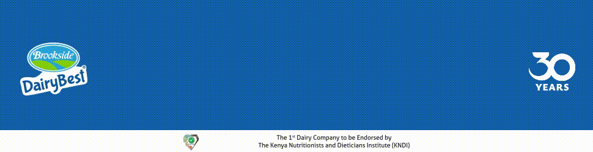

import logo from './Brookside.png';
import imageHero from './banner.gif';

export const caseStudy = {
  client: 'Brookside',
  title: 'Brookside Dairy Best',
  description:
    'Brookside Dairy Bests Chai Kweli programmatic campaign aimed to build brand awareness and increase audience engagement.',
  summary: [
    'Brookside Dairy Bests Chai Kweli programmatic campaign aimed to build brand awareness and increase audience engagement.',
    'By optimizing ad placements and formats, the campaign effectively reached its target audience.',
    'Suss Ads used proprietary inventory on local websites to connect the ads with the most relevant viewers',
  ],
  logo,
  image: { src: imageHero },
  date: '2024-09',
  service: 'Programmatic',
};

export const metadata = {
  title: `${caseStudy.client} Case Study`,
  description: caseStudy.description,
};

## **Overview**

 
The campaign’s success relied on **continuous optimization**, delivering **measurable
results** that exceeded expectations.

 
### Channels Used

- Suss Ads Programmatic Advertising

 

#### Ad Formats Used

 

- **Video Box**
- **Gamified Ad**
- **GIFs**
- **Flip Parallax**
- **Rotating Cube**
- **Display**

 
#### Campaign Results
 
Over a **3-month period**, the Brookside Dairy Best campaign made a strong impact:

- **30 million impressions** captured the audience's attention.
- Over **100,000 clicks** showed solid engagement.
- An average **CTR of 0.7%**, exceeding industry standards.

This performance proved how **targeted strategies** and **precise execution** can elevate digital campaigns.

 

#### Key Factors for Success

 

The campaign succeeded by focusing on **local websites**, engaging Brookside Dairy’s audience with **precision**. Using **Suss Ads' proprietary website and app inventory**, the ads reached **high-traffic locations**, ensuring **visibility**.

Regular optimization refined placements and boosted performance. **Data-driven decisions** helped the campaign surpass **ROI expectations**.

 

#### Client Feedback

 

Brookside Dairy was thrilled with the results. The campaign **exceeded expectations**, confirming **Suss Ads' expertise** in programmatic advertising. Their **strategic execution** and **adaptability** set a new standard for digital campaigns.

 

> _“At Brookside, we believe in the power of digital advertising. With our wide range of dairy products, Suss Ads helped us reach our consumers through engaging and diverse ad formats.”_  
> — **Elizabeth Dina**, Head of Digital, Brookside Dairy

 

<iframe
  width="100%"
  height="400px"
  src="https://www.youtube.com/embed/WVkYVwdP49w"
  title="Brookside Dairy Best Chai Kweli Digital Campaign"
  frameborder="0"
  allow="accelerometer; autoplay; clipboard-write; encrypted-media; gyroscope; picture-in-picture"
  allowfullscreen
></iframe>

<StatList>
  <StatListItem value="30M" label="Impressions" />
  <StatListItem value="100K+" label="Clicks" />
  <StatListItem value="0.7%" label="CTR" />
</StatList>
