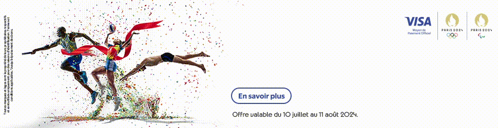

import logo from './logo.png';
import banner from './banner.png';

export const caseStudy = {
  client: 'Visa',
  title: 'Visa Summer Olympics Games',
  description:
    'Visa 2024 Summer Olympics campaign in Mauritius and Madagascar was a successful digital marketing effort that utilized innovative ad formats and precise targeting to increase brand visibility and engagement.',
  summary: [
    'Visa 2024 Summer Olympics campaign in Mauritius and Madagascar was a resounding success.',
    'Leveraging the global reach of the event, Visa employed a targeted digital marketing strategy to increase brand visibility and engagement.',
    'By combining innovative ad formats with data-driven optimization, Visa achieved impressive results, surpassing industry benchmarks and solidifying its position as a leader in the digital payment space.',
  ],
  logo,
  image: { src: banner },

date: '2024-09',
service: 'Programmatic',
};

export const metadata = {
  title: `${caseStudy.client} Case Study`,
  description: caseStudy.description,
};

**Client**: [Visa (Mauritius & Madagascar)](https://corporate.visa.com/en/about-visa/sponsorships-promotions/olympics-paralympics-partnership.html)  
**Agencies**: [Access Leo Burnett](https://accessleoburnett.co.ke/) & [Suss Ads](https://suss.co.ke/)

 
## Overview

Visa's 2024 Summer Olympics campaign sought to dominate the digital payment space in **Mauritius** and **Madagascar**. Leveraging the global reach of the **Olympics**, Visa boosted its brand’s visibility and engagement. The campaign used **cutting-edge ads** and **precise targeting** to stay top-of-mind for consumers in key markets.

 

## Campaign Objective

The goal was simple: Make a lasting impact during the Olympics. Visa’s ads were placed on **high-traffic websites** and **apps**. The strategy combined **interactive** and **traditional ad formats** to keep Visa in the spotlight.

 
## Strategic Approach

 
### Targeting Precision

Visa's ads weren’t scattered. A **programmatic strategy** ensured they reached the most visited sites and apps. Using **data**, the campaign hit the right audience, driving engagement and recall across the region.

 

### Multi-Format Creative

Visa’s creative mix made waves. The campaign used:

- **Display Ads**
- **3D Cube Rotation**
- **Flip Parallax**
- **HTML5 Clip Path**
- **GIFs**
- **Gamified Ads**

This variety ensured Visa stood out, offering an **immersive experience** that engaged users during the Olympics.

 
## Execution and Innovation
 

We adapted the campaign to **local behaviors** in **Mauritius** and **Madagascar**. With **Suss Ads' platform**, Visa’s ads appeared on top sites and apps, blending **traditional display ads** with **interactive formats**. The result? Over **80 million impressions** during the Olympics, with **real-time optimization** fine-tuning every placement.

 
## Results
 

### Mauritius

 

- **70+ million impressions**
- **513,336 clicks**
- **0.815% CTR** (above benchmarks)

 

### Madagascar

 

- **18+ million impressions**
- **129,504 clicks**
- **0.68% CTR**

 

The combination of engaging formats and precise targeting led to high engagement. The campaign’s results far surpassed industry standards.

 

## Anniversary Incentive

 

To mark **Suss Ads' third anniversary**, Visa and **Access Leo Burnett** received a **30% media value add**. This strengthened our relationship and highlighted our commitment to providing added value.

 

## Key Takeaways

 

- **Creative Innovation**: A blend of traditional and innovative ad formats like **3D Cube Rotation** and **puzzle gamified ads** fueled engagement.
- **Data-Driven Optimization**: **Real-time tracking** kept the campaign performing above industry averages.
- **Targeted Impact**: The programmatic strategy ensured Visa reached key audiences efficiently, enhancing its presence.

 

## Conclusion

 
Visa’s 2024 Summer Olympics campaign excelled by blending **creative execution**,
**data insights**, and **precise audience targeting**. With **88 million impressions**
and nearly **643,000 clicks**, Visa’s brand visibility soared. This campaign set
a new benchmark for digital marketing in **Mauritius** and **Madagascar**, proving
the value of **innovation** and **smart strategy**.
 

<StatList>
  <StatListItem value="80M+" label="Impressions" />
  <StatListItem value="600K+" label="Clicks" />
  <StatListItem value="0.7%" label="CTR" />
</StatList>
